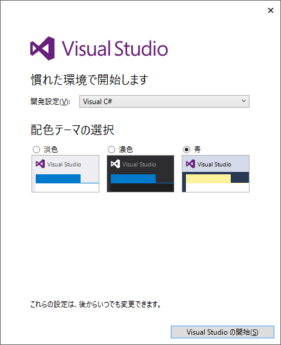

## 0.最初のゼロ歩

### はじめに
この講座では、Altseedというゲームエンジンを使って簡単なインベーダーゲームを作ることを通して、ゲーム制作の基礎を身に付けていこうと思います。
>ちなみに：画像を表示したり音を鳴らしたり、というのは本来とても複雑な記述が必要です。これを代わりにやってくれるのがゲームエンジンで、私たちはゲームエンジンを活用することにより、ゲームの内容を記述することに注力することができます。

ここではプログラミング言語にC#を用います。プログラミングが初めてでも都度簡単な説明を加えていきますが、C#自体をもっと詳しく知りたい人には[C#によるプログラミング入門](http://ufcpp.net/study/csharp/) をオススメします。
C言語やJavaなら使ったことがあるよーという人にもC#らしい便利な機能を知ってもらう機会になれば、と思います。

### C#プログラミングをする環境を整えよう

#### Visual Studioのインストール
C#でプログラミングをするにはVisual Studioというソフトウェアを使います。
[Visual StudioのWebページ](https://www.microsoft.com/ja-jp/download/details.aspx?id=48146)から `vs_community.exe` をダウンロードし、終わったらダウンロードしたインストーラを起動し Visual Studio Community 2015 をインストールします。
個人でアプリケーション開発をする分には無料で利用できるそうです。

インストールが完了したら、試しに Visual Studio を起動してみましょう。初めて起動する際は、使う人に合わせていくつかの設定が行われます。最初にサインインを迫られますが、ひとまずは`後で行う。`で大丈夫です。

次の画面では`開発設定`を`Visual C#`にしておきましょう。配色テーマはお好みで。`Visual Studioの開始(S)`をクリックするといよいよ Visual Studio が起動します。

##### DirectX エンドユーザ ランタイムのインストール
[DirectX エンドユーザ ランタイムのWebページ](https://www.microsoft.com/ja-jp/download/details.aspx?id=35&)から、`DirectX エンドユーザ ランタイム`のインストーラをダウンロードします。ダウンロードが終わったら、これを使って DirectX エンドユーザ ランタイム をインストールします。 Altseed を使って作られたゲームを実行するのに必要です。

>ちなみに：ダウンロードの際に聞かれる`その他の推奨ダウンロード`と、インストールの際に聞かれる`Bingツールバー`はAltseedでのゲーム制作には特に必要ないので、お好みでそうぞ。

### 準備は以上です
ここまでの準備はうまくできましたか？ではいよいよ次章からゲームを作っていきます！
