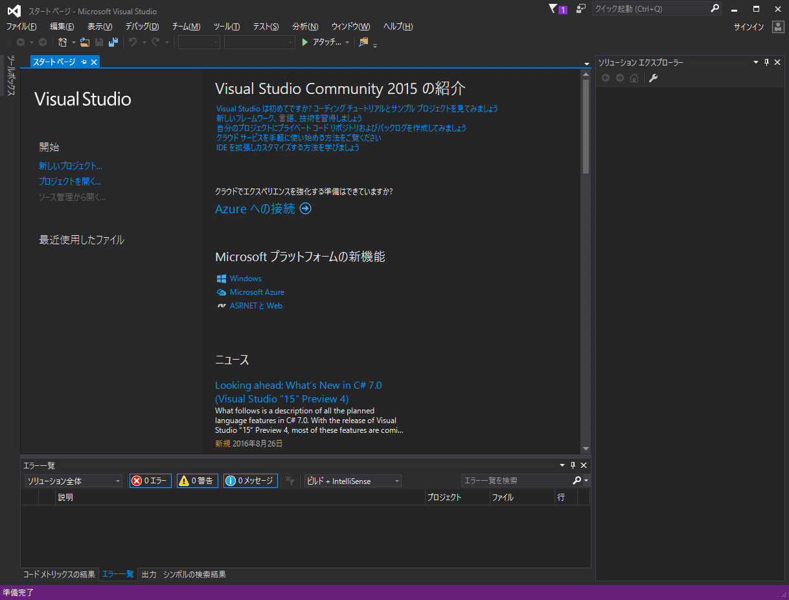
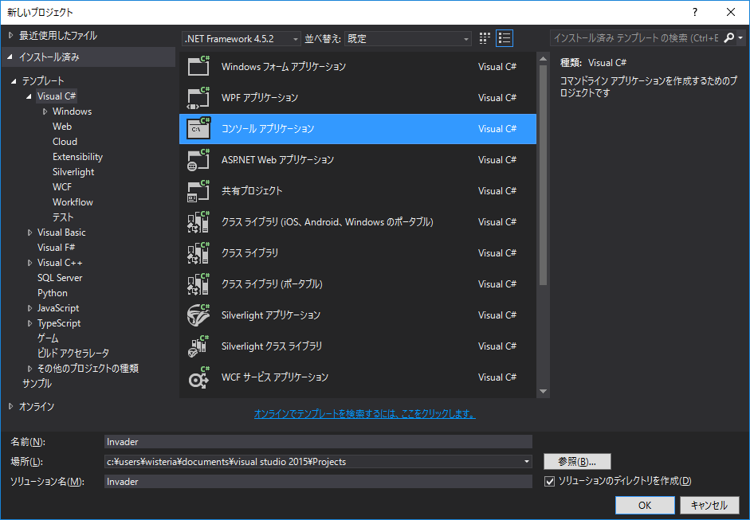
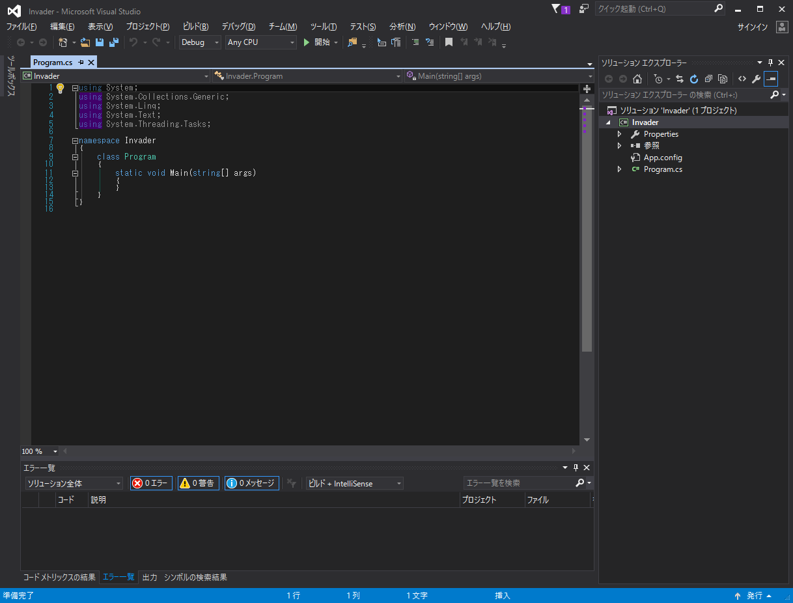
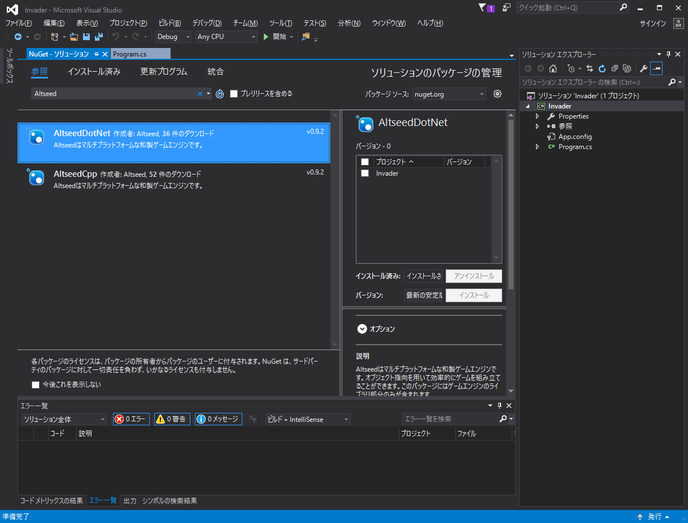
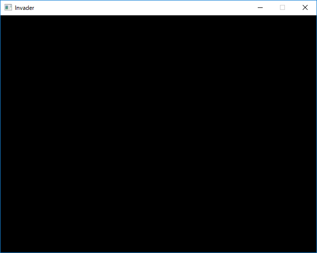

## 1.まずはゲームのウインドウを出そう

### プロジェクトを作成しよう
それでは早速、前回インストールした Visual Studio を用いてゲーム開発をしていきます。



Visual Studio を起動したときに表示される`スタートページ`には新しくプロジェクトを作るための項目や、作っている途中のプロジェクトをすぐに再開するための項目が用意されています。 Visual Studio に新たに追加された機能などに関するニュースが載っていたりもするので興味があったら読んでみるといいと思います。

ここでは新しいプロジェクトを作るので`開始`のところにある`新しいプロジェクト...`を選択します。



`インストール済み` → `テンプレート` → `Visual C#` → `コンソールアプリケーション`の順に選んでいきます。名前はわかりやすいものを付けておきましょう。

>ここでいう名前とはゲームのタイトルというよりも、コードネームみたいなものなので深く考えなくてもよいです。例では`Invader`としています。

`OK`をクリックすると新しいプロジェクトが作成されます。



プロジェクトの作成に成功すると上のような画面に移ります。ここにソースコードを書いてゲームを作っていきます。

### Altseed を使う準備をしよう

Altseed を使ってゲームをつくっていくにあたり、まずは Altseed をプロジェクトに取り込む必要があります。

Visual Studio の画面上部にある`ツール(T)` → `NuGet パッケージ マネージャー(N)` → `ソリューションの NuGet パッケージの管理(N)...`を選択します。
現れた`NuGet - ソリューション`ページの中にある`参照`を選択します。続いて、`検索 (Ctrl+E)`となっているところに`Altseed`と入力して Enter キーを押します。



`AltseedDotNet`を選択するとその右側に、Altseedを取り込むプロジェクトを選ぶ画面が出てくるので先ほど付けたプロジェクトの名前のところにチェックを入れて`インストール`をクリックします。

インストールが完了したら、`NuGet - ソリューション`ページは閉じて構いません。

### ウインドウを表示してみよう

お疲れさまでした。ここまでで準備は整いました。いよいよコードを書いていきます。すでに以下のようなコードが書かれていると思います。

```diff
using System;
using System.Collections.Generic;
using System.Linq;
using System.Text;
using System.Threading.Tasks;

namespace Invader
{
    class Program
    {
        static void Main(string[] args)
        {

        }
    }
}

```

これらの意味は少し後回しにすることにして、さっそく Altseed の力を使ってゲームに使うウインドウを表示してみようと思います。緑色になっている部分を書き足してください。

```diff
using System;
using System.Collections.Generic;
using System.Linq;
using System.Text;
using System.Threading.Tasks;

namespace Invader
{
    class Program
    {
        static void Main(string[] args)
        {
+            asd.Engine.Initialize("Invader", 640, 480, new asd.EngineOption());
+
+            while(asd.Engine.DoEvents())
+            {
+                asd.Engine.Update();
+            }
+
+            asd.Engine.Terminate();
        }
    }
}
```

追記できたら、`F5`キーを押してください。ここまでのことが上手くいっていたら、下のようなウインドウが表示されるはずです。



### 結局何を書いたのだろうか

ウインドウが表示できました、めでたしめでたしでは意味がないので、さきほど何を書いたのかを解説していきます。

```
asd.Engine.Initialize("Invader", 640, 480, new asd.EngineOption());
```

まずは Altseed 自身を起動します。ウインドウタイトル・ウインドウの横幅・ウインドウの高さ、その他のオプションをこの順に渡すことでAltseedを使う準備がなされ、ウインドウが作成されます。

```
while(asd.Engine.DoEvents())
{

}
```

while 文は特定の条件をみたす間何度も何度も同じ処理を実行するという構文です。その条件として`asd.Engine.DoEvents()`を用いています。これはウインドウが閉じられてしまった、などの異常事態になっておらず Altseed による制御を維持できるかを判定しています。

while 文については[C# によるプログラミング入門   反復処理](http://ufcpp.net/study/csharp/st_loop.html?sec=while#while)に詳しく書かれています。

```
asd.Engine.Update();
```

Altseed の更新を行います。いろんな変化（キャラクタの位置が変わる、など）はこのタイミングで起こっている、と考えてください。

```
asd.Engine.Terminate();
```

Altseed の使用を終了します。後片付けはきちんとやりましょう。

### まとめ
ここまででウインドウの表示ができました。このウインドウにキャラクタを描いたり文字を表示したりすることで、少しずつゲームらしくしていきます。


念のため[1章のプロジェクトファイル](./Invader01.zip?raw=true)を置いておきますが、まずは一通り自分でやってみてくださいね。
