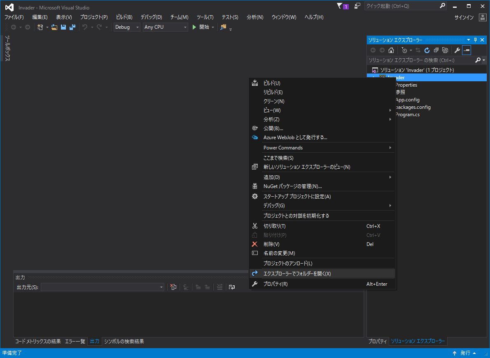
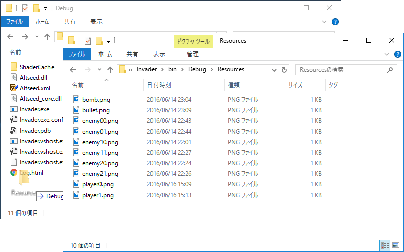
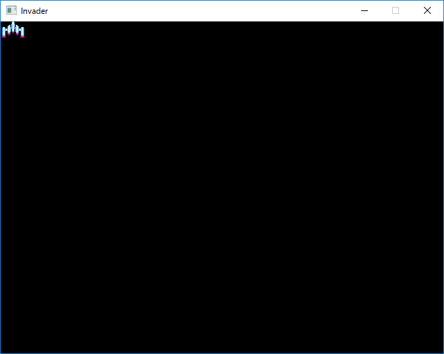

## 2.画像を表示してみよう

### 画像を用意しよう

黒い画面が表示されるだけではどうしようもないので、プレイヤーが操作する自機キャラクタの画像を表示する機能を追加します。今回は Amusement Creators の けんペン さんにキャラクタ一式のドット絵を描いてもらったのでそれを使おうと思います。感謝(^人^)  
下記のリソースをダウンロードして後述のようにプロジェクトフォルダにコピーします。もちろん自分で描いても構いません。その場合、画像のサイズは多少異なっても構いませんので、PNG 形式にするようにしてください。


[リソース](./resources.zip?raw=true)

では用意したリソースを、作成するプログラムから読みやすい場所に配置します。 Visual Studio でプロジェクトを開くと、`ソリューション エクスプローラー`というウインドウが表示されます。

>表示されていない場合は Visual Studio 上部の`表示(V)`の中の`ソリューション エクスプローラー (P)`をクリックして、ウインドウを出してください。

`ソリューション エクスプローラー`には現在開いているプロジェクトを構成するファイルの一覧がツリー状に表示されます。`ソリューション 'Invader' (1プロジェクト)`の一つ下にあるプロジェクト(緑の枠の中にC#と書かれたアイコンとその右に`Invader`)を右クリックして表示されるコンテキストメニューの中から`エクスプローラーでフォルダーを開く(X)`を選択します。

>ソリューションは、プロジェクトをひとまとめにしたものです。大きなプログラムでは、プロジェクトを分割することがあります。そういった場合は関連するプロジェクトをひとまとめにして扱えた方が便利なので、ソリューションという単位でもってそれらのプロジェクトを扱います。



するといま作成しているゲームのプロジェクトフォルダが表示されます。ここまでの手順を正しく行っていると、中に`bin`
というフォルダがあり、さらにその中に`Debug`というフォルダがあると思います。ここに`Resources`というフォルダを作り、用意した画像ファイルを全て入れてください。



### 画像を読み込んで表示しよう

次に先ほど追加した画像を読み込んで表示するコードを書きます。`Program.cs`に対して緑の部分のコードを書き足してください。例によって行頭の + は要りません。

```diff
using System;
using System.Collections.Generic;
using System.Linq;
using System.Text;
using System.Threading.Tasks;

namespace Invader
{
    class Program
    {
        static void Main(string[] args)
        {
            asd.Engine.Initialize("Invader", 640, 480, new asd.EngineOption());
+
+            asd.TextureObject2D player = new asd.TextureObject2D();
+            player.Texture = asd.Engine.Graphics.CreateTexture2D("Resources/player0.png");
+            asd.Engine.AddObject2D(player);
+
            while(asd.Engine.DoEvents())
            {
                asd.Engine.Update();
            }

            asd.Engine.Terminate();
        }
    }
}

```

書けたら`F5`キーを押してみてください。ここまでうまくいっていると下のようなウインドウが表示されるはずです。何も表示されない場合は、`Resources/player0.png`の部分のスペルミスがないかなどをよく確認してみてください。



### 結局何を書いたのだろうか

```
asd.TextureObject2D player = new asd.TextureObject2D();
```
画像を画面に表示するためのモノを作ります。[C# によるプログラミング入門 クラス](http://ufcpp.net/study/csharp/oo_class.html)に詳しく書かれていますが、`asd.TextureObject2D`という、「画像を画面に表示するモノ」の設計図をもとにして新しく(`new`)実体を作ります。 そしてこれに`player`という名前を付けておきます。この設計図のことを`クラス`、クラスを元に作成した実体のことを`インスタンス`と呼びます。

Altseed にはあらかじめ様々なクラスが入っているので、これを組み合わせることによって簡単にゲームを作成することができます。

```
player.Texture = asd.Engine.Graphics.CreateTexture2D("Resources/player0.png");
```

次に、`player`が表示する画像を登録します。`asd.Engine.Graphics.CreateTexture2D`というのは画像を読み込むためのメソッド(命令)だと思ってください。実行ファイルはさきほどのプロジェクトフォルダの中の`bin`の中の`Debug`の中に作られているので、そこから見て`Resources`の中にある`player0.png`を指定しています。

```
asd.Engine.AddObject2D(player);
```

最後に、`player`を Altseed に登録します。 Altseed のエンジンに登録されて初めて`player`は画像を表示することができます。

### まとめ
Altseed に用意されたクラスのインスタンスを作成・登録することで自機画像が表示されました。  
次回はこれを動くようにしたいと思います。


例によって[2章のプロジェクトファイル](./Invader02.zip?raw=true)を置いておきますが、まずは一通り自分でやってみてくださいね。
